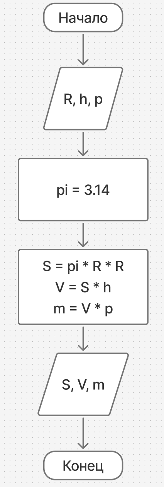
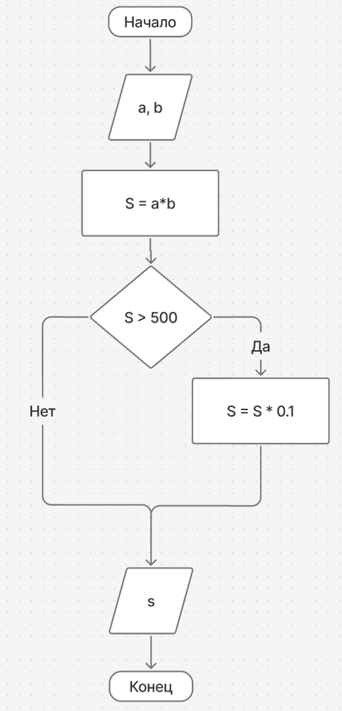
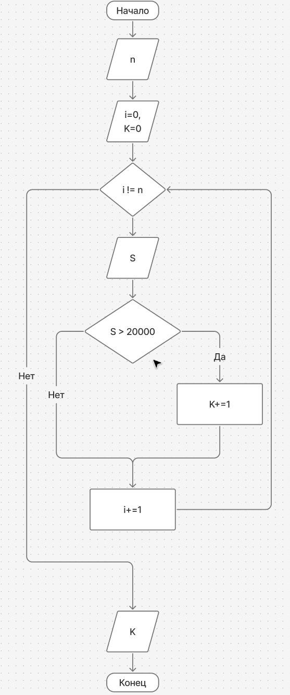
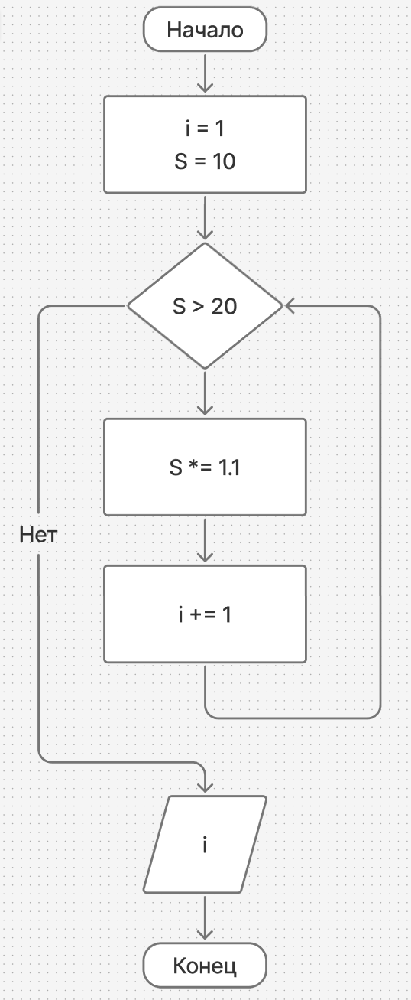
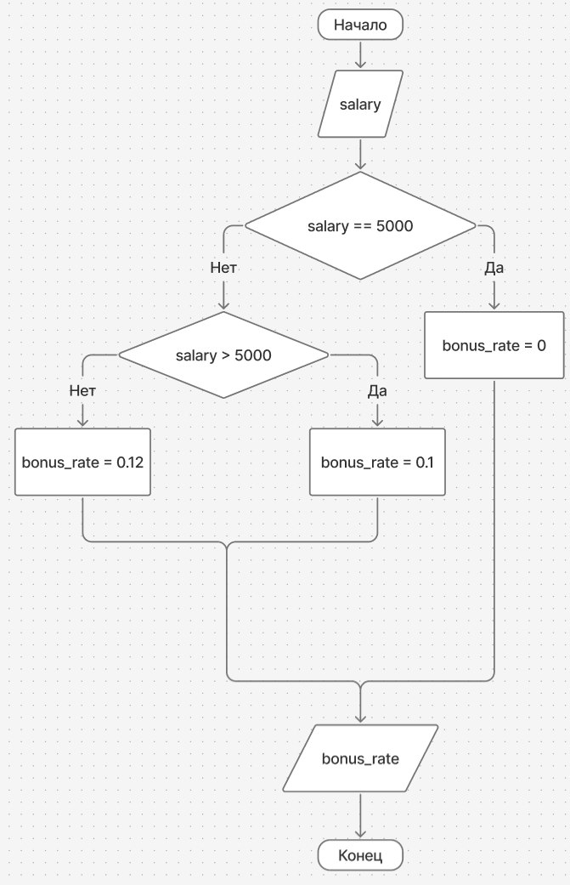
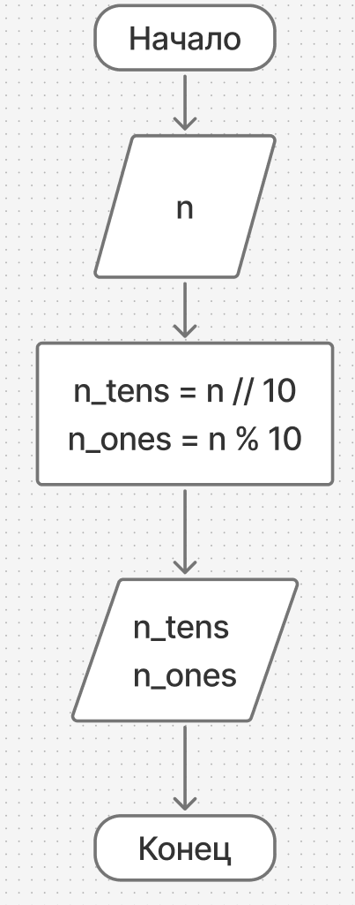
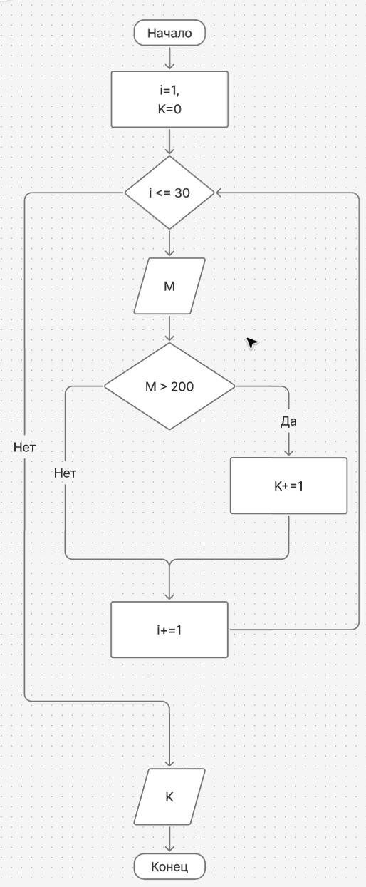
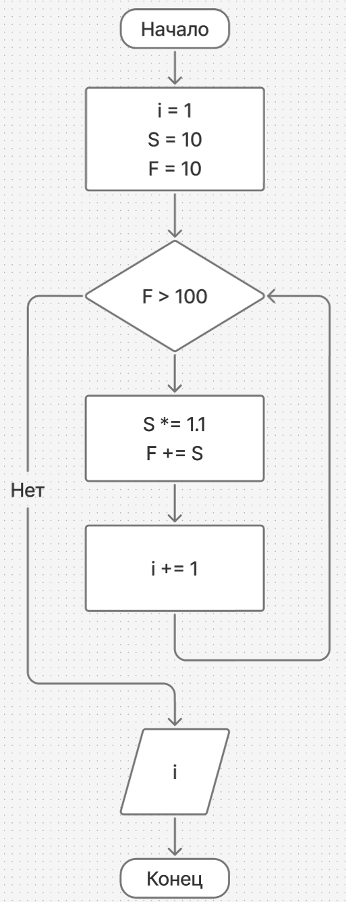
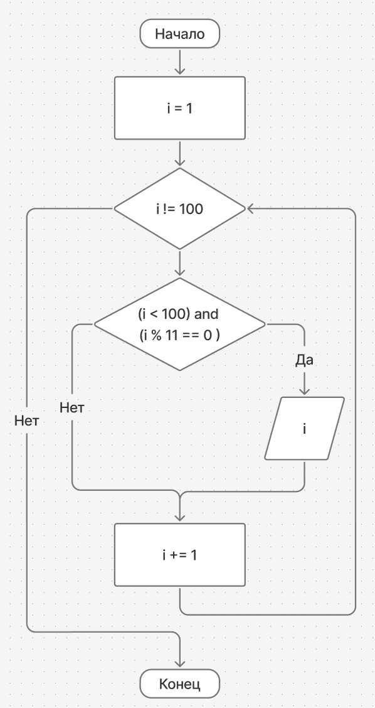
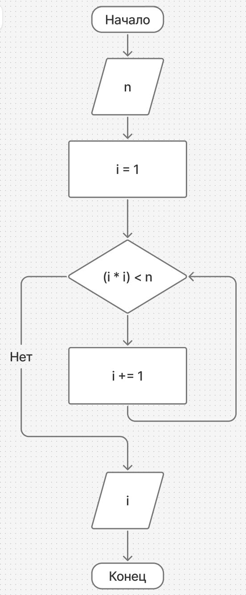

# Практическое занятие №2. «Создание блок схем по задания»

## Задача 1.
Составить алгоритм вычисления объема, массы и площади основания цилиндрического тела, если известны его плотность и геометрические размеры: радиус основания и высота.
— Входные данные: R (радиус основания цилиндра), h (высота цилиндра), ρ (плотность материала);
— Выходные данные: m (масса), V (объем), S (площадь основания).

## Задача 2.
Составить алгоритм вычисления стоимости покупки с учетом скидки: при покупке товара на сумму больше 500 руб. предоставляется скидка 10 %.
— Входные данные: a (цена единицы товара), b (количество единиц товара);
— Выходные данные: s (сумма покупки).

## Задача 3.
Составить алгоритм подсчета количества сотрудников фирмы, зарплата которых превышает 20 тыс. руб. 
— Входные данные: n (число сотрудников); S (размер зарплаты); i (параметр);
— Выходные данные: счетчик К (количество сотрудников).

## Задача 4.
Начав тренировки, лыжник в первый день пробежал 10 км. Каждый следующий день он увеличивал пробег на 10 % от пробега предыдущего дня. Составить алгоритм определения, в какой день он пробежит больше 20 км.

## Задача 5. 
Составить алгоритм расчета премии: если оклад сотрудника > 5 000 процент премии составляет 10%; если оклад < 5 000, то процент премии равен 12%.

## Задача 6. 
Составить алгоритм нахождения числа десятков и единиц в двухзначном числе.

## Задача 7.
Известны данные о мощности (в единицах силы) двигателей 30 моделей легковых автомобилей. Составить алгоритм определения среди них количества моделей, мощность двигателя которых превышает 200 единиц силы.

## Задача 8.
Начав тренировки, лыжник в первый день пробежал 10 км. Каждый следующий день он увеличивал пробег на 10 % от пробега предыдущего дня. Составить алгоритм определения, в какой день суммарный пробег за все дни превысит 100 км.

## Задача 9.
Составить алгоритм вывода всех натуральных чисел, кратных одиннадцати, меньше 100.

## Задача 10.
Дано число n. Составить алгоритм поиска первого натурального числа, квадрат которого больше n

